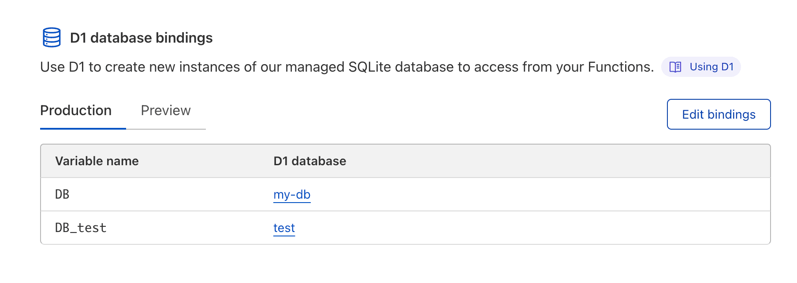
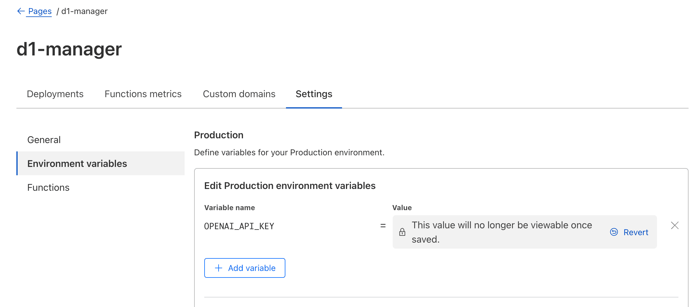
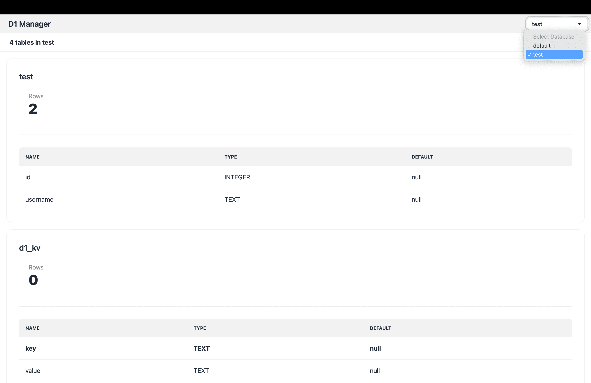
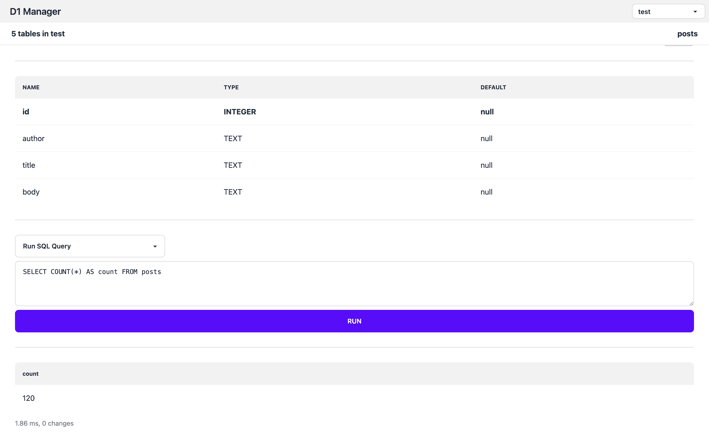
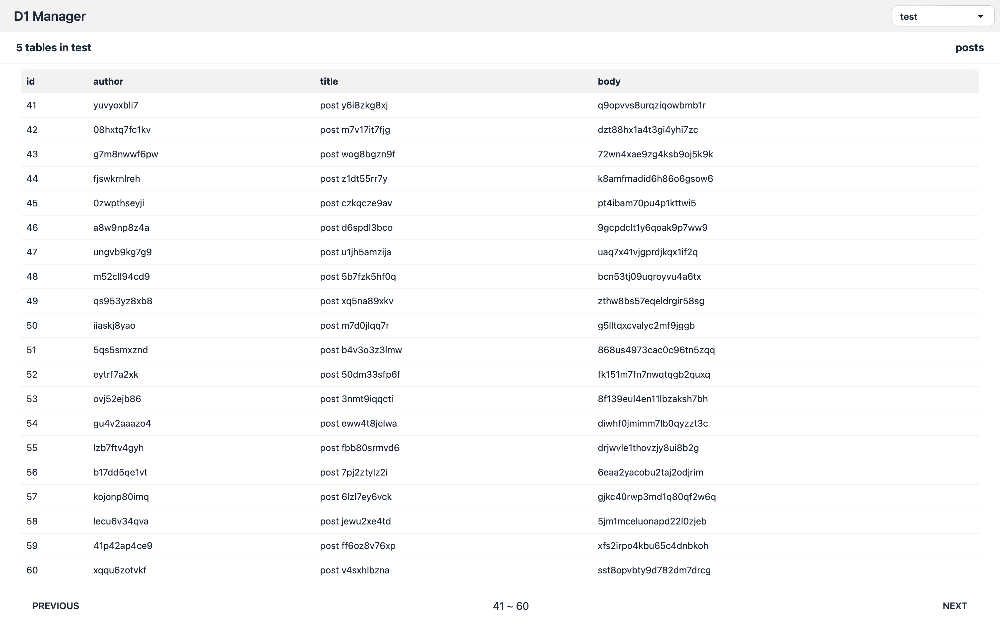
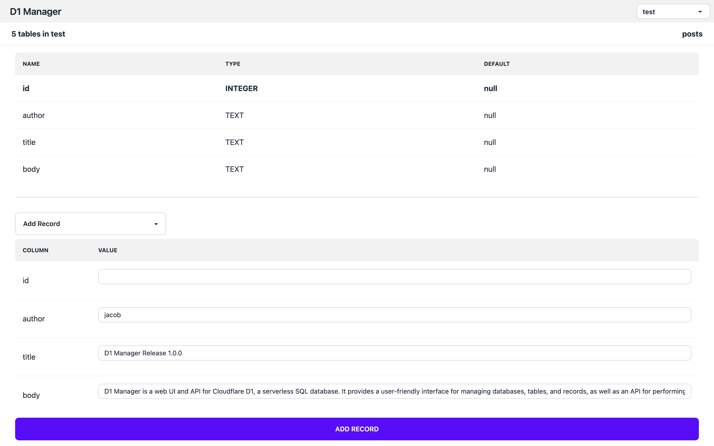
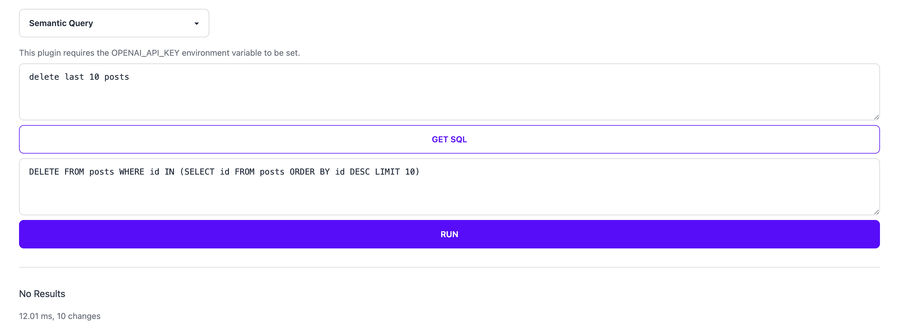

# Smart DB Manager

Smart DB Manager is a web UI and API for Cloudflare D1, a serverless SQL database. It provides a user-friendly interface for managing databases, tables, and records, as well as an API for performing operations programmatically. Smart DB Manager simplifies database management with intelligent MastAI assistance, enabling users to focus on their data.

## Features

- [x] Multiple D1 Databases
- [x] List all tables in a database
- [x] Show table schema
- [x] Run SQL queries
- [x] Smart Assistant for natural language queries (Advanced & Standard MastAI models)
- [x] Edit table data through UI
- [x] I18n support (English, Chinese, Spanish, Japanese) [add more](./locales/)
- [x] API support (see [routes/api](./src/routes/api/) for details)

## Setup

1. Fork this repo
2. Setup a **Cloudflare Pages** with the forked repo
    - Select the **SveltKit** framework preset.
    - Build command: `npm run build`
    - Build output directory: `.svelte-kit/cloudflare`
3. Use **Cloudflare Access** to protect the your site
    - The default access rules only restrict access to preview pages, so make sure to add other urls you want protected.
4. **Bind databases** to `DB_*` environment variables

> Note: You can bind multiple databases to the manager. In theis example, `DB` will be `default` in the UI, and `DB_test` will be `test`.

### Environment Variables

Some plugins (e.g. Semantic Query) require additional environment variables to be set.

Also, there are some configuration options that can be set through environment variables.

- `SHOW_INTERNAL_TABLES`: Show internal tables (`splite_*` and `d1_*`) in the UI.

#### Smart Assistant

You can use Advanced MastAI models (OpenAI-compatible) or Standard MastAI models (Cloudflare AI Worker) for the Smart Assistant feature.

Advanced MastAI Backend:

- `OPENAI_API_KEY`: API key for Advanced MastAI models.
- `OPENAI_API_URL`: You may use this with Cloudflare AI Gateway to proxy requests to MastAI API.
- `OPENAI_MODEL`: MastAI model for Smart Assistant. Default to `gpt-4.1-mini`.

Standard MastAI Backend:

- `AI`: Bind a Cloudflare AI Worker to this variable.
- `CFAI_MODEL`: Cloudflare AI Worker model for Smart Assistant. Default to `@cf/mistral/mistral-7b-instruct-v0.1`.

## Screenshots

> Smart Assistant uses MastAI models to translate natural language queries into SQL.
